# Диаграммы последовательностей — Backend Use Cases

Все диаграммы выполнены в формате **Mermaid `sequenceDiagram`**.

---

## B-UC-1.1 — Авторизация через OAuth

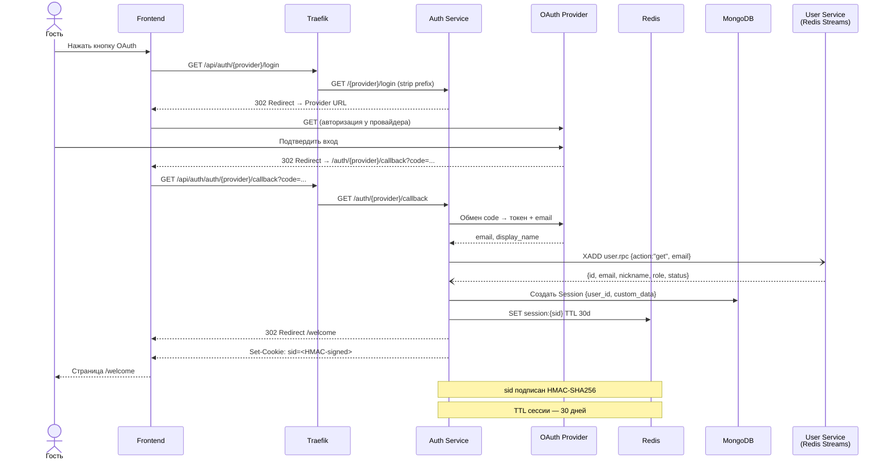
```mermaid
sequenceDiagram
    actor Гость
    participant FE as Frontend
    participant Traefik
    participant Auth as Auth Service
    participant Provider as OAuth Provider<br/>
    participant Redis
    participant MongoDB
    participant UserRPC as User Service<br/>(Redis Streams)

    Гость->>FE: Нажать кнопку OAuth
    FE->>Traefik: GET /api/auth/{provider}/login
    Traefik->>Auth: GET /{provider}/login (strip prefix)
    Auth-->>FE: 302 Redirect → Provider URL

    FE->>Provider: GET (авторизация у провайдера)
    Гость->>Provider: Подтвердить вход
    Provider-->>FE: 302 Redirect → /auth/{provider}/callback?code=...

    FE->>Traefik: GET /api/auth/auth/{provider}/callback?code=...
    Traefik->>Auth: GET /auth/{provider}/callback
    Auth->>Provider: Обмен code → токен + email
    Provider-->>Auth: email, display_name

    Auth-)UserRPC: XADD user.rpc {action:"get", email}
    UserRPC--)Auth: {id, email, nickname, role, status}

    Auth->>MongoDB: Создать Session {user_id, custom_data}
    Auth->>Redis: SET session:{sid} TTL 30d

    Auth-->>FE: 302 Redirect /welcome
    Auth-->>FE: Set-Cookie: sid=<HMAC-signed>
    FE-->>Гость: Страница /welcome

    Note over Auth,Redis: sid подписан HMAC-SHA256
    Note over Auth,Redis: TTL сессии — 30 дней
```

---

## B-UC-1.2 — Авторизация по email

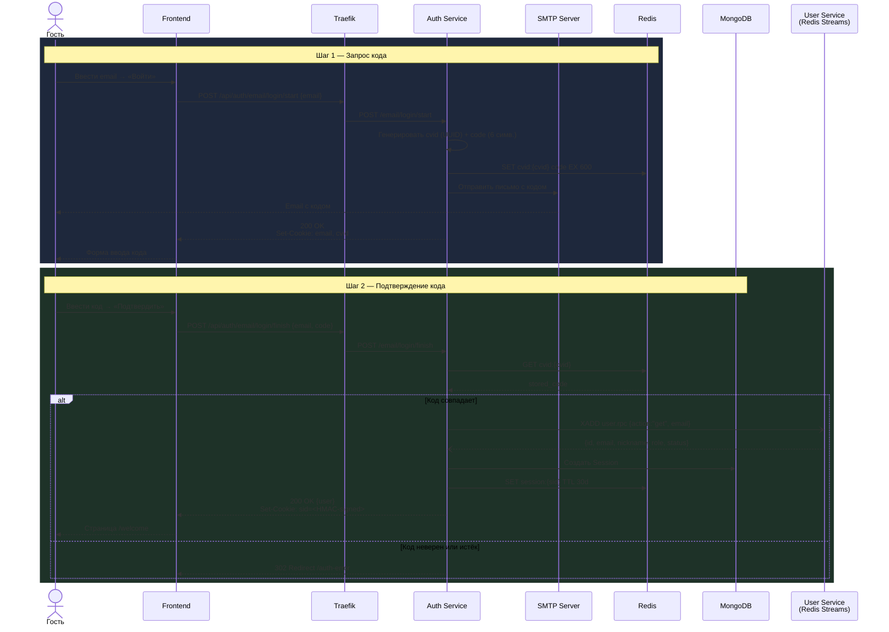
```mermaid
sequenceDiagram
    actor Гость
    participant FE as Frontend
    participant Traefik
    participant Auth as Auth Service
    participant SMTP as SMTP Server
    participant Redis
    participant MongoDB
    participant UserRPC as User Service<br/>(Redis Streams)

    rect rgb(30, 40, 60)
        Note over Гость,Redis: Шаг 1 — Запрос кода
        Гость->>FE: Ввести email → «Войти»
        FE->>Traefik: POST /api/auth/email/login/start {email}
        Traefik->>Auth: POST /email/login/start

        Auth->>Auth: Генерировать cvid (UUID) + code (6 симв.)
        Auth->>Redis: SET cvid:{cvid} code  EX 600
        Auth->>SMTP: Отправить письмо с кодом
        SMTP-->>Гость: Email с кодом

        Auth-->>FE: 200 OK<br/>Set-Cookie: email, cvid
        FE-->>Гость: Форма ввода кода
    end

    rect rgb(30, 50, 40)
        Note over Гость,MongoDB: Шаг 2 — Подтверждение кода
        Гость->>FE: Ввести код → «Подтвердить»
        FE->>Traefik: POST /api/auth/email/login/finish {email, code}
        Traefik->>Auth: POST /email/login/finish

        Auth->>Redis: GET cvid:{cvid}
        Redis-->>Auth: stored_code

        alt Код совпадает
            Auth-)UserRPC: XADD user.rpc {action:"get", email}
            UserRPC--)Auth: {id, email, nickname, role, status}

            Auth->>MongoDB: Создать Session
            Auth->>Redis: SET session:{sid} TTL 30d
            Auth-->>FE: 200 OK {user}<br/>Set-Cookie: sid=<HMAC-signed>
            FE-->>Гость: Страница /welcome
        else Код неверен или истёк
            Auth-->>FE: 302 Redirect /auth-error
        end
    end
```

---

## B-UC-1.3 — Получение текущего пользователя / Межсервисная валидация

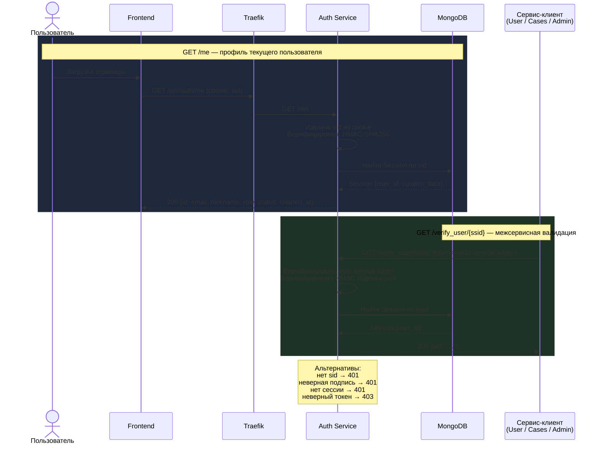
```mermaid
sequenceDiagram
    actor User as Пользователь
    participant FE as Frontend
    participant Traefik
    participant Auth as Auth Service
    participant MongoDB
    participant SvcClient as Сервис-клиент<br/>(User / Cases / Admin)

    rect rgb(30, 40, 60)
        Note over User,MongoDB: GET /me — профиль текущего пользователя
        User->>FE: Загрузка страницы
        FE->>Traefik: GET /api/auth/me (cookie: sid)
        Traefik->>Auth: GET /me

        Auth->>Auth: Извлечь sid из cookie<br/>Верифицировать HMAC-SHA256
        Auth->>MongoDB: Найти Session по sid
        MongoDB-->>Auth: Session {user_id, custom_data}
        Auth-->>FE: 200 {id, email, nickname, role, status, created_at}
    end

    rect rgb(30, 50, 40)
        Note over SvcClient,MongoDB: GET /verify_user/{ssid} — межсервисная валидация
        SvcClient->>Auth: GET /verify_user/{ssid}?token=<inter-service-token>

        Auth->>Auth: Верифицировать inter-service token<br/>Верифицировать HMAC подпись ssid
        Auth->>MongoDB: Найти Session по ssid
        MongoDB-->>Auth: Session {user_id}
        Auth-->>SvcClient: 200 {uid: "..."}
    end

    Note over Auth: Альтернативы:<br/>нет sid → 401<br/>неверная подпись → 401<br/>нет сессии → 401<br/>неверный токен → 403
```

---

## B-UC-1.4 — Logout и верификация профиля

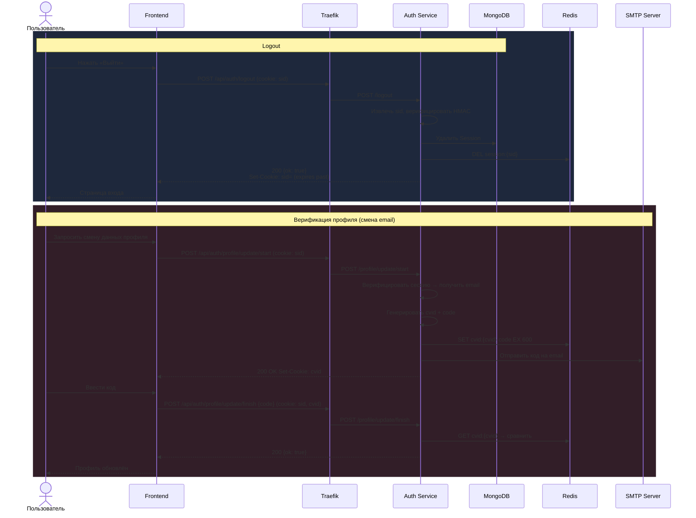
```mermaid
sequenceDiagram
    actor User as Пользователь
    participant FE as Frontend
    participant Traefik
    participant Auth as Auth Service
    participant MongoDB
    participant Redis
    participant SMTP as SMTP Server

    rect rgb(30, 40, 60)
        Note over User,MongoDB: Logout
        User->>FE: Нажать «Выйти»
        FE->>Traefik: POST /api/auth/logout (cookie: sid)
        Traefik->>Auth: POST /logout

        Auth->>Auth: Извлечь sid, верифицировать HMAC
        Auth->>MongoDB: Удалить Session
        Auth->>Redis: DEL session:{sid}
        Auth-->>FE: 200 {ok: true}<br/>Set-Cookie: sid= (expires past)
        FE-->>User: Страница входа
    end

    rect rgb(50, 30, 40)
        Note over User,SMTP: Верификация профиля (смена email)
        User->>FE: Запросить смену данных профиля
        FE->>Traefik: POST /api/auth/profile/update/start (cookie: sid)
        Traefik->>Auth: POST /profile/update/start

        Auth->>Auth: Верифицировать сессию → получить email
        Auth->>Auth: Генерировать cvid + code
        Auth->>Redis: SET cvid:{cvid} code  EX 600
        Auth->>SMTP: Отправить код на email
        Auth-->>FE: 200 OK  Set-Cookie: cvid

        User->>FE: Ввести код
        FE->>Traefik: POST /api/auth/profile/update/finish {code} (cookie: sid, cvid)
        Traefik->>Auth: POST /profile/update/finish

        Auth->>Redis: GET cvid:{cvid} → сравнить
        Auth-->>FE: 200 {ok: true}
        FE-->>User: Профиль обновлён
    end
```

---

## B-UC-2.1 — Получение и обновление профиля пользователя

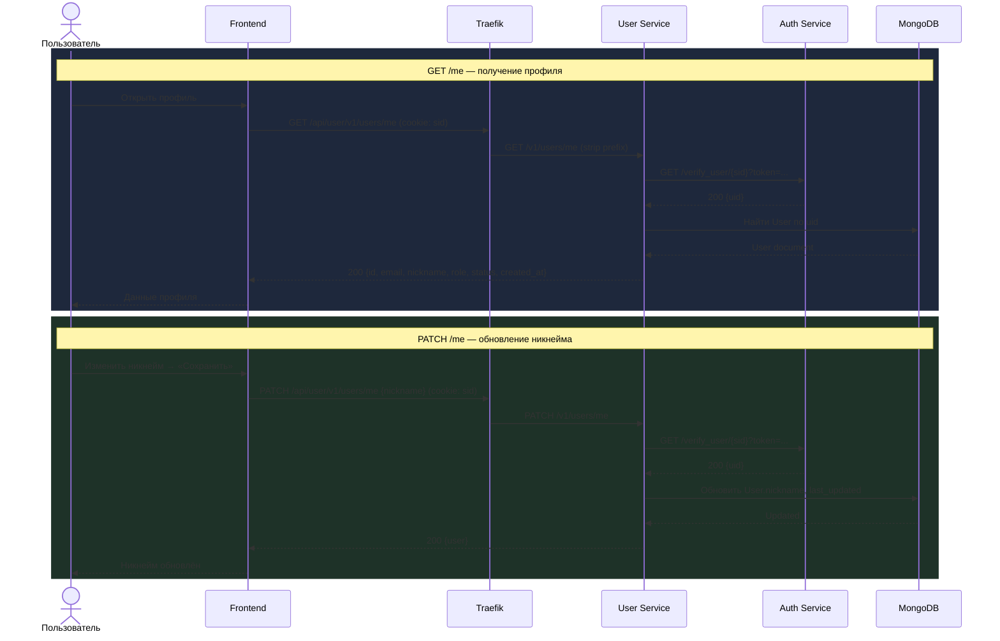
```mermaid
sequenceDiagram
    actor User as Пользователь
    participant FE as Frontend
    participant Traefik
    participant UserSvc as User Service
    participant Auth as Auth Service
    participant MongoDB

    rect rgb(30, 40, 60)
        Note over User,MongoDB: GET /me — получение профиля
        User->>FE: Открыть профиль
        FE->>Traefik: GET /api/user/v1/users/me (cookie: sid)
        Traefik->>UserSvc: GET /v1/users/me (strip prefix)

        UserSvc->>Auth: GET /verify_user/{sid}?token=...
        Auth-->>UserSvc: 200 {uid}

        UserSvc->>MongoDB: Найти User по uid
        MongoDB-->>UserSvc: User document
        UserSvc-->>FE: 200 {id, email, nickname, role, status, created_at}
        FE-->>User: Данные профиля
    end

    rect rgb(30, 50, 40)
        Note over User,MongoDB: PATCH /me — обновление никнейма
        User->>FE: Изменить никнейм → «Сохранить»
        FE->>Traefik: PATCH /api/user/v1/users/me {nickname} (cookie: sid)
        Traefik->>UserSvc: PATCH /v1/users/me

        UserSvc->>Auth: GET /verify_user/{sid}?token=...
        Auth-->>UserSvc: 200 {uid}

        UserSvc->>MongoDB: Обновить User.nickname, last_updated
        MongoDB-->>UserSvc: Updated
        UserSvc-->>FE: 200 {user}
        FE-->>User: Никнейм обновлён
    end
```

---

## B-UC-2.2 — Создание пользователя при первом входе

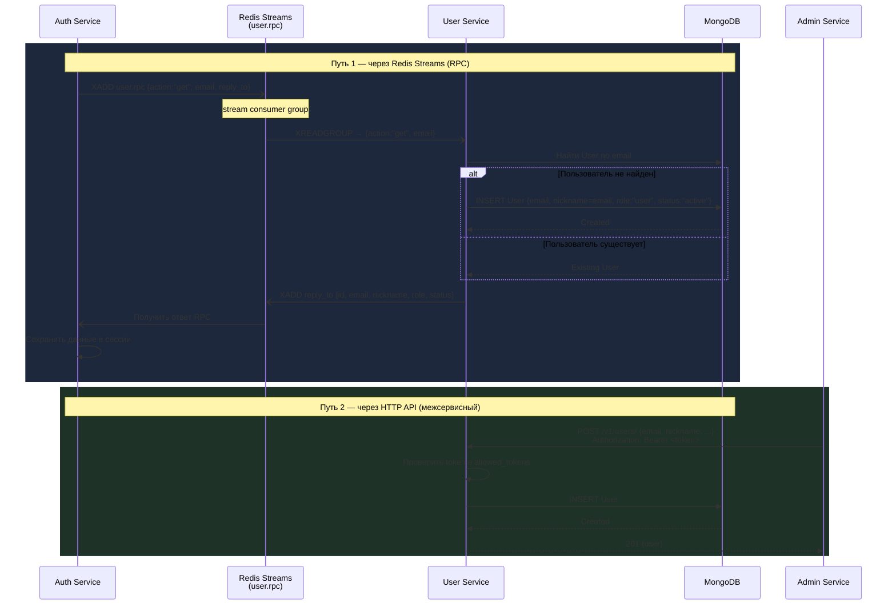
```mermaid
sequenceDiagram
    participant Auth as Auth Service
    participant Redis as Redis Streams<br/>(user.rpc)
    participant UserSvc as User Service
    participant MongoDB

    rect rgb(30, 40, 60)
        Note over Auth,MongoDB: Путь 1 — через Redis Streams (RPC)
        Auth-)Redis: XADD user.rpc {action:"get", email, reply_to}
        Note over Redis: stream consumer group
        Redis-)UserSvc: XREADGROUP → {action:"get", email}

        UserSvc->>MongoDB: Найти User по email
        alt Пользователь не найден
            UserSvc->>MongoDB: INSERT User {email, nickname=email, role:"user", status:"active"}
            MongoDB-->>UserSvc: Created
        else Пользователь существует
            MongoDB-->>UserSvc: Existing User
        end

        UserSvc-)Redis: XADD reply_to {id, email, nickname, role, status}
        Redis-)Auth: Получить ответ RPC
        Auth->>Auth: Сохранить данные в сессии
    end

    rect rgb(30, 50, 40)
        Note over Auth,MongoDB: Путь 2 — через HTTP API (межсервисный)
        participant AdminSvc as Admin Service
        AdminSvc->>UserSvc: POST /v1/users/ {email, nickname, ...}<br/>Authorization: Bearer <token>
        UserSvc->>UserSvc: Проверить token в allowed_tokens
        UserSvc->>MongoDB: INSERT User
        MongoDB-->>UserSvc: Created
        UserSvc-->>AdminSvc: 201 {user}
    end
```

---

## B-UC-2.3 — Публичный профиль и управление статусом

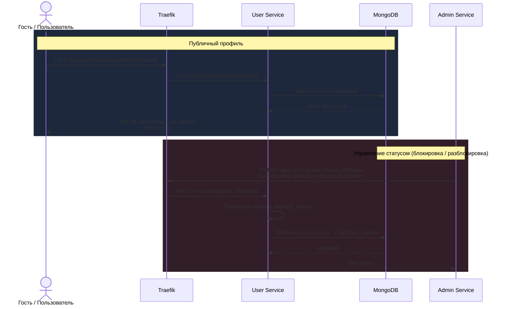
```mermaid
sequenceDiagram
    actor Visitor as Гость / Пользователь
    participant Traefik
    participant UserSvc as User Service
    participant MongoDB
    participant AdminSvc as Admin Service

    rect rgb(30, 40, 60)
        Note over Visitor,MongoDB: Публичный профиль
        Visitor->>Traefik: GET /api/user/v1/users/public/{nickname}
        Traefik->>UserSvc: GET /v1/users/public/{nickname}
        UserSvc->>MongoDB: Найти User по nickname
        MongoDB-->>UserSvc: User document
        UserSvc-->>Visitor: 200 {id, nickname, role, status}<br/>(без email)
    end

    rect rgb(50, 30, 40)
        Note over AdminSvc,MongoDB: Управление статусом (блокировка / разблокировка)
        AdminSvc->>Traefik: PATCH /api/user/v1/users/{user_id}/status<br/>Authorization: Bearer <inter-service-token>
        Traefik->>UserSvc: PATCH /v1/users/{user_id}/status

        UserSvc->>UserSvc: Проверить token в allowed_tokens
        UserSvc->>MongoDB: Обновить User.status → blocked / active
        MongoDB-->>UserSvc: Updated
        UserSvc-->>AdminSvc: 200 {user}
    end
```

---

## B-UC-3.1 — Получение списка кейсов

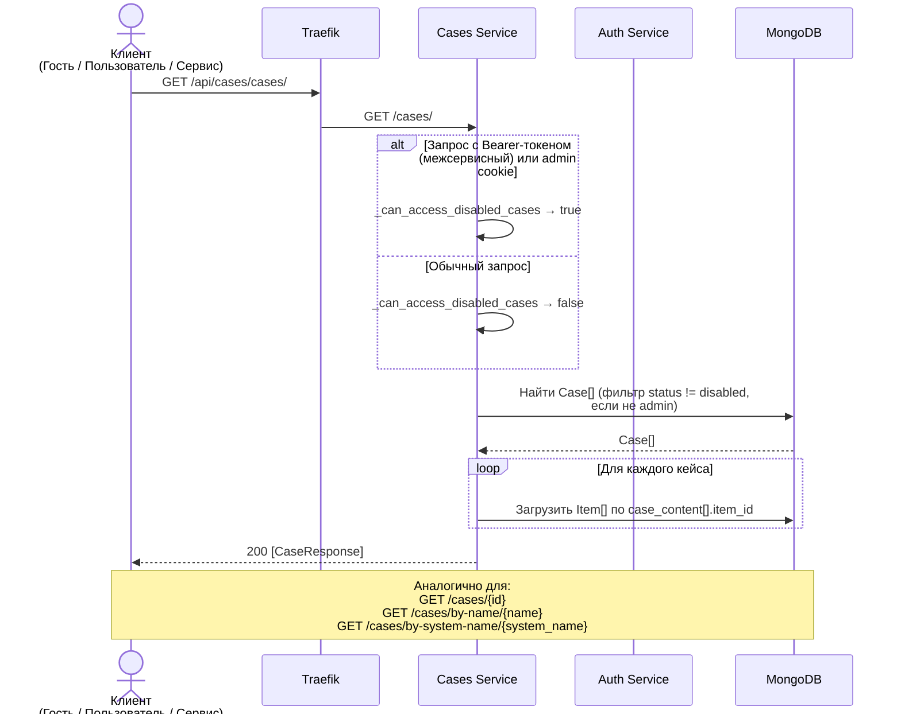
```mermaid
sequenceDiagram
    actor Client as Клиент<br/>(Гость / Пользователь / Сервис)
    participant Traefik
    participant Cases as Cases Service
    participant Auth as Auth Service
    participant MongoDB

    Client->>Traefik: GET /api/cases/cases/
    Traefik->>Cases: GET /cases/

    alt Запрос с Bearer-токеном (межсервисный) или admin cookie
        Cases->>Cases: _can_access_disabled_cases → true
    else Обычный запрос
        Cases->>Cases: _can_access_disabled_cases → false
    end

    Cases->>MongoDB: Найти Case[] (фильтр status != disabled,<br/>если не admin)
    MongoDB-->>Cases: Case[]

    loop Для каждого кейса
        Cases->>MongoDB: Загрузить Item[] по case_content[].item_id
    end

    Cases-->>Client: 200 [CaseResponse]

    Note over Client,MongoDB: Аналогично для:<br/>GET /cases/{id}<br/>GET /cases/by-name/{name}<br/>GET /cases/by-system-name/{system_name}
```

---

## B-UC-3.2 — Открытие кейса пользователем

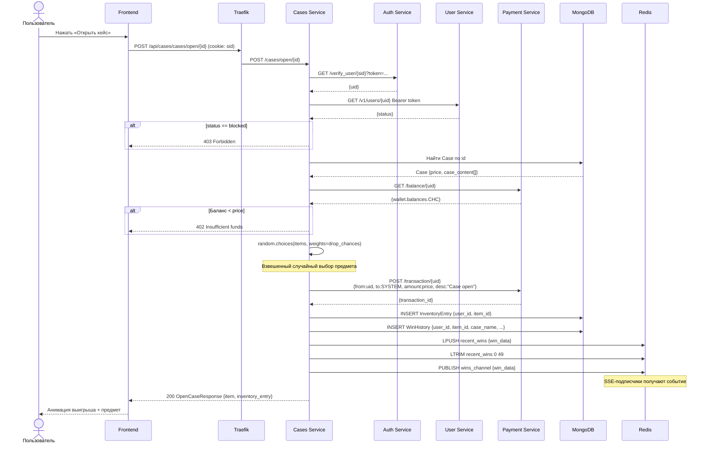
```mermaid
sequenceDiagram
    actor User as Пользователь
    participant FE as Frontend
    participant Traefik
    participant Cases as Cases Service
    participant Auth as Auth Service
    participant UserSvc as User Service
    participant Payment as Payment Service
    participant MongoDB
    participant Redis

    User->>FE: Нажать «Открыть кейс»
    FE->>Traefik: POST /api/cases/cases/open/{id} (cookie: sid)
    Traefik->>Cases: POST /cases/open/{id}

    Cases->>Auth: GET /verify_user/{sid}?token=...
    Auth-->>Cases: {uid}

    Cases->>UserSvc: GET /v1/users/{uid}  Bearer token
    UserSvc-->>Cases: {status}
    alt status == blocked
        Cases-->>FE: 403 Forbidden
    end

    Cases->>MongoDB: Найти Case по id
    MongoDB-->>Cases: Case {price, case_content[]}

    Cases->>Payment: GET /balance/{uid}
    Payment-->>Cases: {wallet.balances.CHC}

    alt Баланс < price
        Cases-->>FE: 402 Insufficient funds
    end

    Cases->>Cases: random.choices(items, weights=drop_chances)
    Note over Cases: Взвешенный случайный выбор предмета

    Cases->>Payment: POST /transaction/{uid}<br/>{from:uid, to:SYSTEM, amount:price, desc:"Case open"}
    Payment-->>Cases: {transaction_id}

    Cases->>MongoDB: INSERT InventoryEntry {user_id, item_id}
    Cases->>MongoDB: INSERT WinHistory {user_id, item_id, case_name, ...}

    Cases->>Redis: LPUSH recent_wins {win_data}
    Cases->>Redis: LTRIM recent_wins 0 49

    Cases->>Redis: PUBLISH wins_channel {win_data}
    Note over Redis: SSE-подписчики получают событие

    Cases-->>FE: 200 OpenCaseResponse {item, inventory_entry}
    FE-->>User: Анимация выигрыша + предмет
```

---

## B-UC-3.3 — SSE-лента и история выигрышей

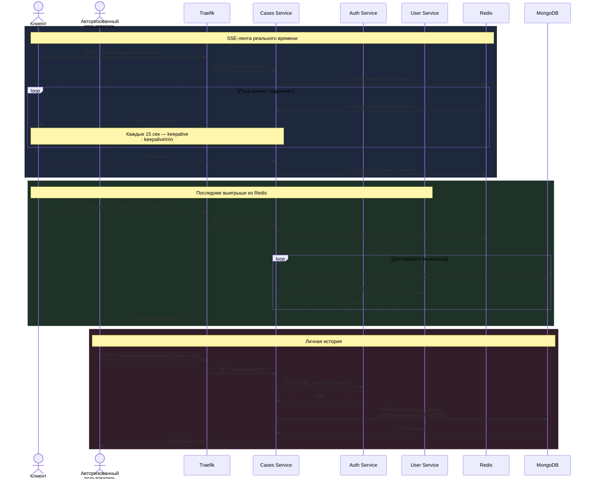
```mermaid
sequenceDiagram
    actor Client as Клиент
    actor AuthUser as Авторизованный<br/>пользователь
    participant Traefik
    participant Cases as Cases Service
    participant Auth as Auth Service
    participant UserSvc as User Service
    participant Redis
    participant MongoDB

    rect rgb(30, 40, 60)
        Note over Client,Redis: SSE-лента реального времени
        Client->>Traefik: GET /api/cases/cases/wins/stream
        Traefik->>Cases: GET /cases/wins/stream
        Cases->>Redis: SUBSCRIBE wins_channel

        loop Пока клиент подключён
            Redis-)Cases: Новый выигрыш (PUBLISH)
            Cases-->>Client: data: {win_data}\n\n

            Note over Cases,Client: Каждые 15 сек — keepalive<br/>: keepalive\n\n
        end

        Client-->>Cases: Disconnect
        Cases->>Redis: UNSUBSCRIBE wins_channel
    end

    rect rgb(30, 50, 40)
        Note over Client,UserSvc: Последние выигрыши из Redis
        Client->>Traefik: GET /api/cases/cases/recent_wins?limit=20
        Traefik->>Cases: GET /cases/recent_wins
        Cases->>Redis: LRANGE recent_wins 0 19
        Redis-->>Cases: [win_json, ...]

        loop Для каждого выигрыша
            Cases->>MongoDB: Item.img_url
            Cases->>UserSvc: GET /v1/users/{user_id}  Bearer token
            UserSvc-->>Cases: {nickname}
        end

        Cases-->>Client: 200 [WinResponse]
    end

    rect rgb(50, 30, 40)
        Note over AuthUser,MongoDB: Личная история
        AuthUser->>Traefik: GET /api/cases/cases/wins/my (cookie: sid)
        Traefik->>Cases: GET /cases/wins/my
        Cases->>Auth: GET /verify_user/{sid}?token=...
        Auth-->>Cases: {uid}
        Cases->>MongoDB: WinHistory.find(user_id=uid)<br/>sort(timestamp desc) limit/offset
        MongoDB-->>Cases: [WinHistory]
        Cases-->>AuthUser: 200 [WinResponse]
    end
```

---

## B-UC-4.1 — Инвентарь и продажа предметов

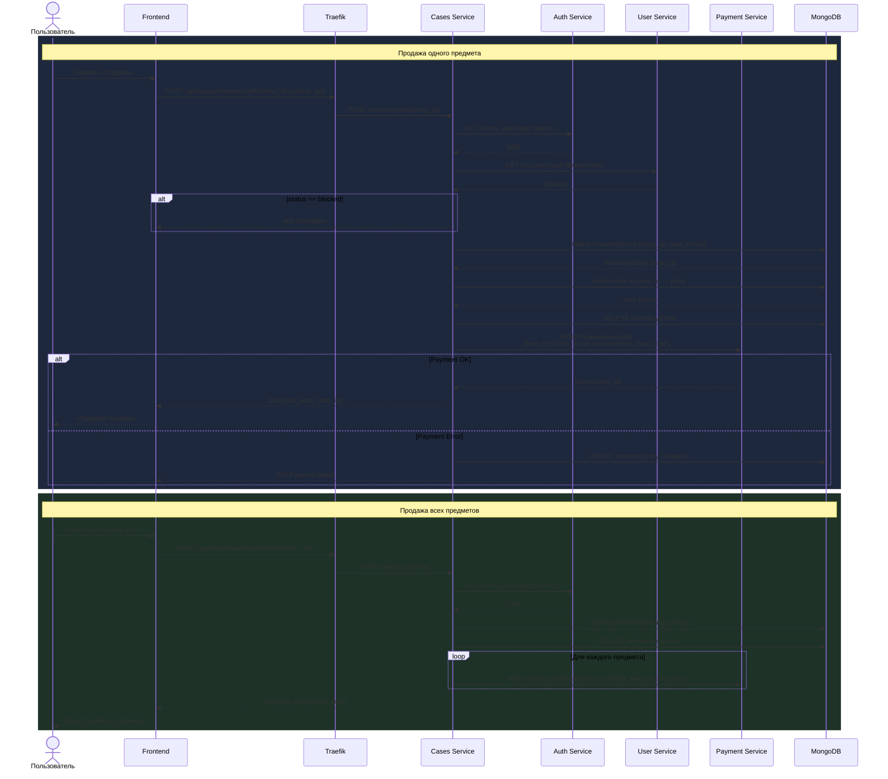
```mermaid
sequenceDiagram
    actor User as Пользователь
    participant FE as Frontend
    participant Traefik
    participant Cases as Cases Service
    participant Auth as Auth Service
    participant UserSvc as User Service
    participant Payment as Payment Service
    participant MongoDB

    rect rgb(30, 40, 60)
        Note over User,MongoDB: Продажа одного предмета
        User->>FE: Нажать «Продать»
        FE->>Traefik: POST /api/cases/inventory/sell/{entry_id} (cookie: sid)
        Traefik->>Cases: POST /inventory/sell/{entry_id}

        Cases->>Auth: GET /verify_user/{sid}?token=...
        Auth-->>Cases: {uid}

        Cases->>UserSvc: GET /v1/users/{uid}  Bearer token
        UserSvc-->>Cases: {status}
        alt status == blocked
            Cases-->>FE: 403 Forbidden
        end

        Cases->>MongoDB: Найти InventoryEntry {entry_id, user_id=uid}
        MongoDB-->>Cases: InventoryEntry {item_id}

        Cases->>MongoDB: Найти Item по item_id → price
        MongoDB-->>Cases: Item {price}

        Cases->>MongoDB: DELETE InventoryEntry
        Cases->>Payment: POST /transaction/{uid}<br/>{from:SYSTEM, to:uid, amount:price, desc:"Sell"}

        alt Payment OK
            Payment-->>Cases: {transaction_id}
            Cases-->>FE: 200 {sold_price, item_id}
            FE-->>User: «Предмет продан»
        else Payment Error
            Cases->>MongoDB: INSERT InventoryEntry (rollback)
            Cases-->>FE: 500 Payment failed
        end
    end

    rect rgb(30, 50, 40)
        Note over User,MongoDB: Продажа всех предметов
        User->>FE: Нажать «Продать всё»
        FE->>Traefik: POST /api/cases/inventory/sell-all (cookie: sid)
        Traefik->>Cases: POST /inventory/sell-all

        Cases->>Auth: GET /verify_user/{sid}?token=...
        Auth-->>Cases: {uid}
        Cases->>MongoDB: Найти все InventoryEntry для uid
        Cases->>MongoDB: DELETE all InventoryEntry

        loop Для каждого предмета
            Cases->>Payment: POST /transaction/{uid} {from:SYSTEM, amount:item.price}
        end

        Cases-->>FE: 200 {sold_count, total_price}
        FE-->>User: «Все предметы проданы»
    end
```

---

## B-UC-4.2 — Получение баланса и транзакций

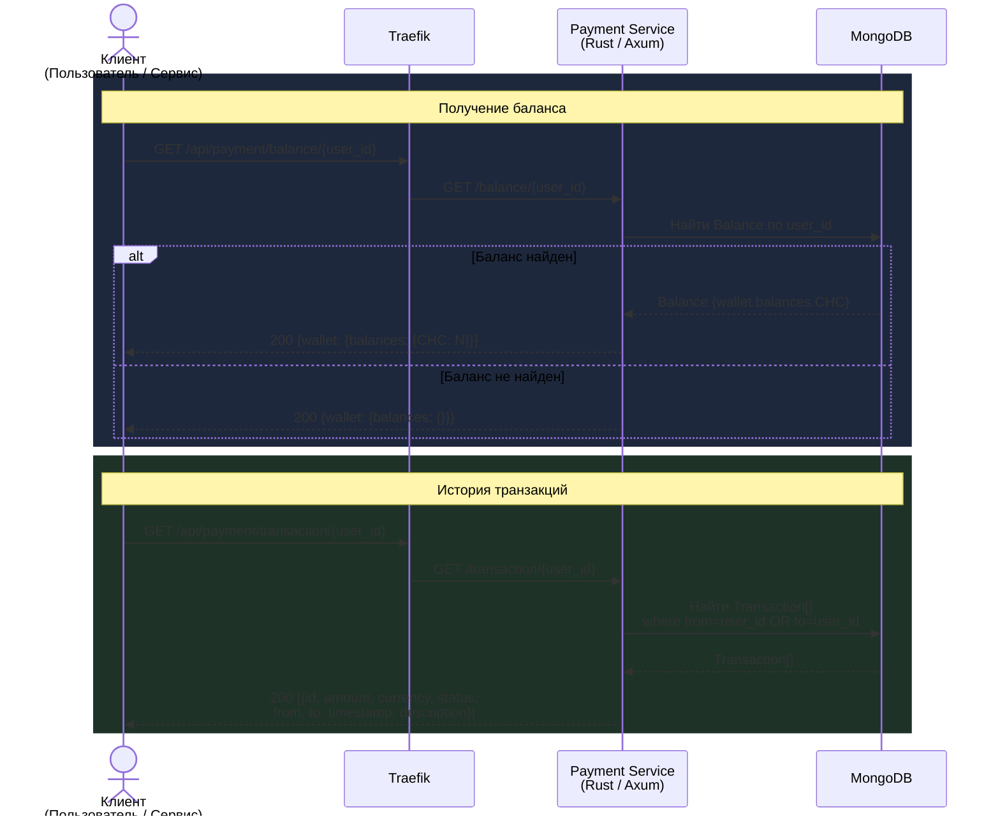
```mermaid
sequenceDiagram
    actor Client as Клиент<br/>(Пользователь / Сервис)
    participant Traefik
    participant Payment as Payment Service<br/>(Rust / Axum)
    participant MongoDB

    rect rgb(30, 40, 60)
        Note over Client,MongoDB: Получение баланса
        Client->>Traefik: GET /api/payment/balance/{user_id}
        Traefik->>Payment: GET /balance/{user_id}

        Payment->>MongoDB: Найти Balance по user_id
        alt Баланс найден
            MongoDB-->>Payment: Balance {wallet.balances.CHC}
            Payment-->>Client: 200 {wallet: {balances: {CHC: N}}}
        else Баланс не найден
            Payment-->>Client: 200 {wallet: {balances: {}}}
        end
    end

    rect rgb(30, 50, 40)
        Note over Client,MongoDB: История транзакций
        Client->>Traefik: GET /api/payment/transaction/{user_id}
        Traefik->>Payment: GET /transaction/{user_id}

        Payment->>MongoDB: Найти Transaction[]<br/>where from=user_id OR to=user_id
        MongoDB-->>Payment: Transaction[]
        Payment-->>Client: 200 [{id, amount, currency, status,<br/>from, to, timestamp, description}]
    end
```

---

## B-UC-5.1 — Аутентификация администратора (Admin BFF)

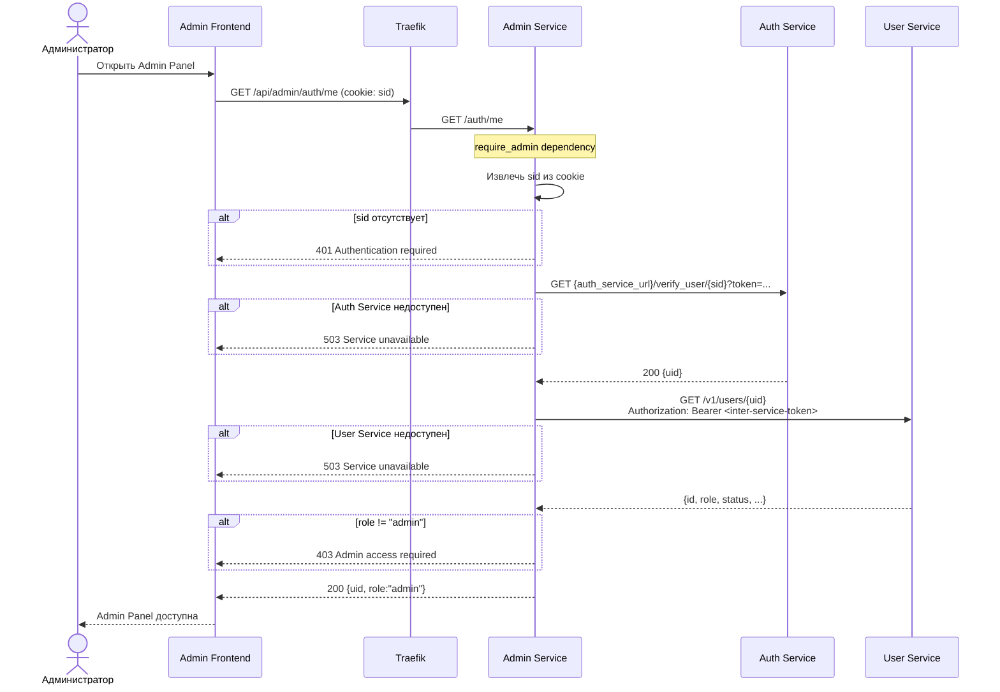
```mermaid
sequenceDiagram
    actor Admin as Администратор
    participant FE as Admin Frontend
    participant Traefik
    participant AdminSvc as Admin Service
    participant Auth as Auth Service
    participant UserSvc as User Service

    Admin->>FE: Открыть Admin Panel
    FE->>Traefik: GET /api/admin/auth/me (cookie: sid)
    Traefik->>AdminSvc: GET /auth/me

    Note over AdminSvc: require_admin dependency

    AdminSvc->>AdminSvc: Извлечь sid из cookie
    alt sid отсутствует
        AdminSvc-->>FE: 401 Authentication required
    end

    AdminSvc->>Auth: GET {auth_service_url}/verify_user/{sid}?token=...
    alt Auth Service недоступен
        AdminSvc-->>FE: 503 Service unavailable
    end
    Auth-->>AdminSvc: 200 {uid}

    AdminSvc->>UserSvc: GET /v1/users/{uid}<br/>Authorization: Bearer <inter-service-token>
    alt User Service недоступен
        AdminSvc-->>FE: 503 Service unavailable
    end
    UserSvc-->>AdminSvc: {id, role, status, ...}

    alt role != "admin"
        AdminSvc-->>FE: 403 Admin access required
    end

    AdminSvc-->>FE: 200 {uid, role:"admin"}
    FE-->>Admin: Admin Panel доступна
```

---

## B-UC-5.2 — Проксирование CRUD и загрузка изображений

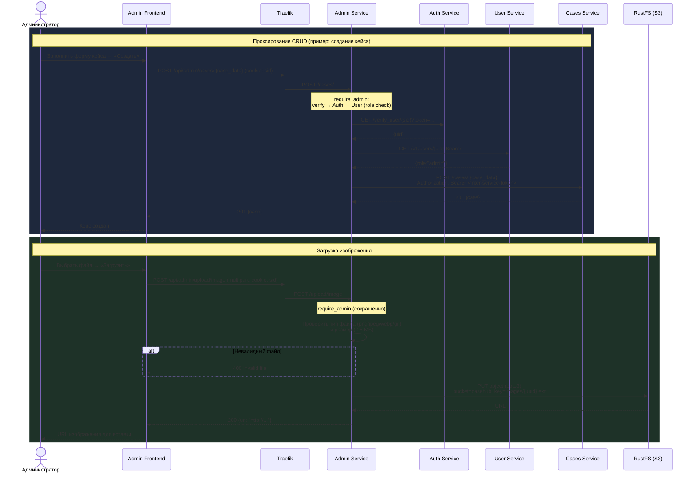
```mermaid
sequenceDiagram
    actor Admin as Администратор
    participant FE as Admin Frontend
    participant Traefik
    participant AdminSvc as Admin Service
    participant Auth as Auth Service
    participant UserSvc as User Service
    participant Cases as Cases Service
    participant RustFS as RustFS (S3)

    rect rgb(30, 40, 60)
        Note over Admin,Cases: Проксирование CRUD (пример: создание кейса)
        Admin->>FE: Заполнить форму кейса → «Создать»
        FE->>Traefik: POST /api/admin/cases/ {case_data} (cookie: sid)
        Traefik->>AdminSvc: POST /cases/

        Note over AdminSvc: require_admin:<br/>verify → Auth → User (role check)
        AdminSvc->>Auth: GET /verify_user/{sid}?token=...
        Auth-->>AdminSvc: {uid}
        AdminSvc->>UserSvc: GET /v1/users/{uid}  Bearer
        UserSvc-->>AdminSvc: {role:"admin"}

        AdminSvc->>Cases: POST /cases/ {case_data}<br/>Authorization: Bearer <inter-service-token>
        Cases-->>AdminSvc: 201 {case}
        AdminSvc-->>FE: 201 {case}
        FE-->>Admin: Кейс создан
    end

    rect rgb(30, 50, 40)
        Note over Admin,RustFS: Загрузка изображения
        Admin->>FE: Выбрать файл → «Загрузить»
        FE->>Traefik: POST /api/admin/upload/image (multipart, cookie: sid)
        Traefik->>AdminSvc: POST /upload/image

        Note over AdminSvc: require_admin (сокращённо)
        AdminSvc->>AdminSvc: Проверить тип файла (png/jpeg/webp/gif)<br/>и размер (≤ 5 МБ)

        alt Невалидный файл
            AdminSvc-->>FE: 400 Invalid file
        end

        AdminSvc->>RustFS: PUT object (boto3)<br/>bucket=casehub, key=images/{uuid}.ext
        RustFS-->>AdminSvc: URL

        AdminSvc-->>FE: 200 {url: "http://..."}
        FE-->>Admin: URL изображения для вставки
    end
```

---

## B-UC-6.1 — Развёртывание инфраструктуры

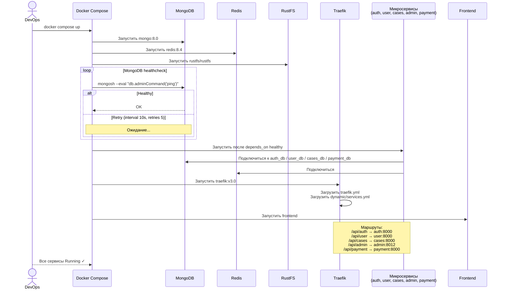
```mermaid
sequenceDiagram
    actor DevOps
    participant DC as Docker Compose
    participant MongoDB
    participant Redis
    participant RustFS
    participant Traefik
    participant Services as Микросервисы<br/>(auth, user, cases, admin, payment)
    participant FE as Frontend

    DevOps->>DC: docker compose up

    DC->>MongoDB: Запустить mongo:8.0
    DC->>Redis: Запустить redis:8.4
    DC->>RustFS: Запустить rustfs/rustfs

    loop MongoDB healthcheck
        DC->>MongoDB: mongosh --eval "db.adminCommand('ping')"
        alt Healthy
            MongoDB-->>DC: OK
        else Retry (interval 10s, retries 5)
            Note over DC,MongoDB: Ожидание...
        end
    end

    DC->>Services: Запустить после depends_on healthy
    Services->>MongoDB: Подключиться к auth_db / user_db / cases_db / payment_db
    Services->>Redis: Подключиться

    DC->>Traefik: Запустить traefik:v3.0
    Traefik->>Traefik: Загрузить traefik.yml<br/>Загрузить dynamic/services.yml

    DC->>FE: Запустить frontend

    Note over Traefik,Services: Маршруты:<br/>/api/auth → auth:8000<br/>/api/user → user:8000<br/>/api/cases → cases:8000<br/>/api/admin → admin:8012<br/>/api/payment → payment:8000

    DevOps-->>DC: Все сервисы Running ✓
```

---

## B-UC-6.2 — Мониторинг сервисов через Grafana

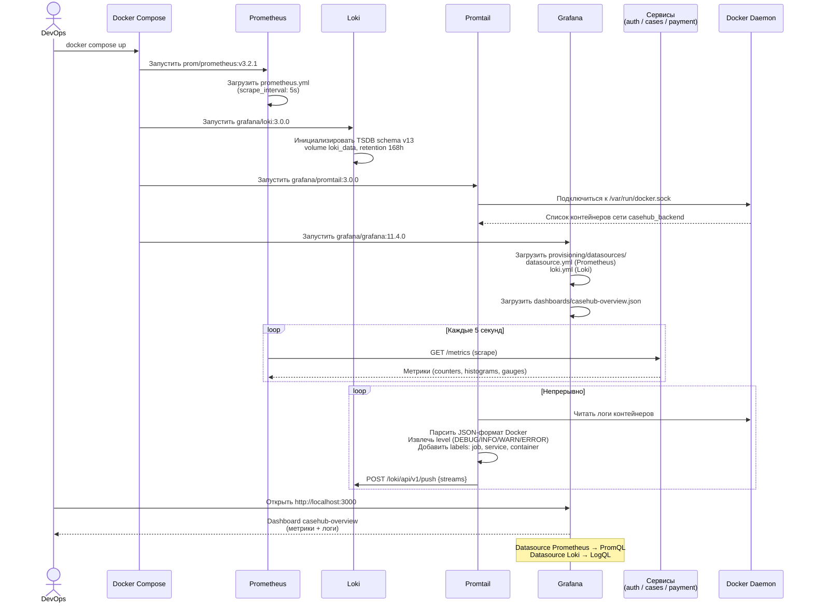
```mermaid
sequenceDiagram
    actor DevOps
    participant DC as Docker Compose
    participant Prometheus
    participant Loki
    participant Promtail
    participant Grafana
    participant Services as Сервисы<br/>(auth / cases / payment)
    participant Docker as Docker Daemon

    DevOps->>DC: docker compose up

    DC->>Prometheus: Запустить prom/prometheus:v3.2.1
    Prometheus->>Prometheus: Загрузить prometheus.yml<br/>(scrape_interval: 5s)

    DC->>Loki: Запустить grafana/loki:3.0.0
    Loki->>Loki: Инициализировать TSDB schema v13<br/>volume loki_data, retention 168h

    DC->>Promtail: Запустить grafana/promtail:3.0.0
    Promtail->>Docker: Подключиться к /var/run/docker.sock
    Docker-->>Promtail: Список контейнеров сети casehub_backend

    DC->>Grafana: Запустить grafana/grafana:11.4.0
    Grafana->>Grafana: Загрузить provisioning/datasources/<br/>datasource.yml (Prometheus)<br/>loki.yml (Loki)
    Grafana->>Grafana: Загрузить dashboards/casehub-overview.json

    loop Каждые 5 секунд
        Prometheus->>Services: GET /metrics (scrape)
        Services-->>Prometheus: Метрики (counters, histograms, gauges)
    end

    loop Непрерывно
        Promtail->>Docker: Читать логи контейнеров
        Promtail->>Promtail: Парсить JSON-формат Docker<br/>Извлечь level (DEBUG/INFO/WARN/ERROR)<br/>Добавить labels: job, service, container
        Promtail->>Loki: POST /loki/api/v1/push {streams}
    end

    DevOps->>Grafana: Открыть http://localhost:3000
    Grafana-->>DevOps: Dashboard casehub-overview<br/>(метрики + логи)

    Note over Grafana: Datasource Prometheus → PromQL<br/>Datasource Loki → LogQL
```

---

## B-UC-7.1 — Синхронизация прогресса фермы

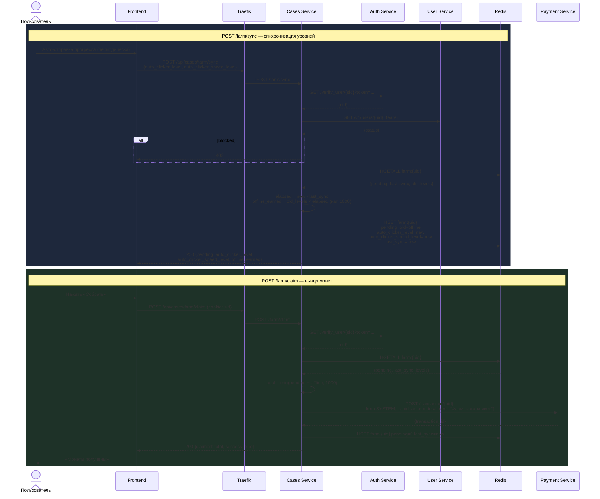
```mermaid
sequenceDiagram
    actor User as Пользователь
    participant FE as Frontend
    participant Traefik
    participant Cases as Cases Service
    participant Auth as Auth Service
    participant UserSvc as User Service
    participant Redis
    participant Payment as Payment Service

    rect rgb(30, 40, 60)
        Note over User,Redis: POST /farm/sync — синхронизация уровней
        User->>FE: Авто-отправка прогресса (периодически)
        FE->>Traefik: POST /api/cases/farm/sync<br/>{auto_clicker_level, auto_clicker_speed_level}
        Traefik->>Cases: POST /farm/sync

        Cases->>Auth: GET /verify_user/{sid}?token=...
        Auth-->>Cases: {uid}
        Cases->>UserSvc: GET /v1/users/{uid}  Bearer
        UserSvc-->>Cases: {status}
        alt blocked
            Cases-->>FE: 403
        end

        Cases->>Redis: HGETALL farm:{uid}
        Redis-->>Cases: {pending, last_sync, old_levels}

        Cases->>Cases: elapsed = now - last_sync<br/>offline_earned = old_levels × elapsed (кап 1000)
        Cases->>Redis: HSET farm:{uid}<br/>pending=old+offline<br/>auto_clicker_level=new<br/>auto_clicker_speed_level=new<br/>last_sync=now

        Cases-->>FE: 200 {pending, auto_clicker_level,<br/>auto_clicker_speed_level, offline_earned}
    end

    rect rgb(30, 50, 40)
        Note over User,Payment: POST /farm/claim — вывод монет
        User->>FE: Нажать «Собрать»
        FE->>Traefik: POST /api/cases/farm/claim (cookie: sid)
        Traefik->>Cases: POST /farm/claim

        Cases->>Auth: GET /verify_user/{sid}?token=...
        Auth-->>Cases: {uid}

        Cases->>Redis: HGETALL farm:{uid}
        Redis-->>Cases: {pending, last_sync, levels}

        Cases->>Cases: total = min(pending + offline, 1000)

        Cases->>Payment: POST /transaction/{uid}<br/>{from:SYSTEM, to:uid, amount:total, desc:"Фарм: авто-кликер"}
        Payment-->>Cases: {transaction_id}

        Cases->>Redis: HSET farm:{uid} pending=0 last_sync=now
        Cases-->>FE: 200 {claimed: total, success: true}
        FE-->>User: «Монеты получены»
    end
```

---

## B-UC-7.2 — Tap и ежедневный бонус

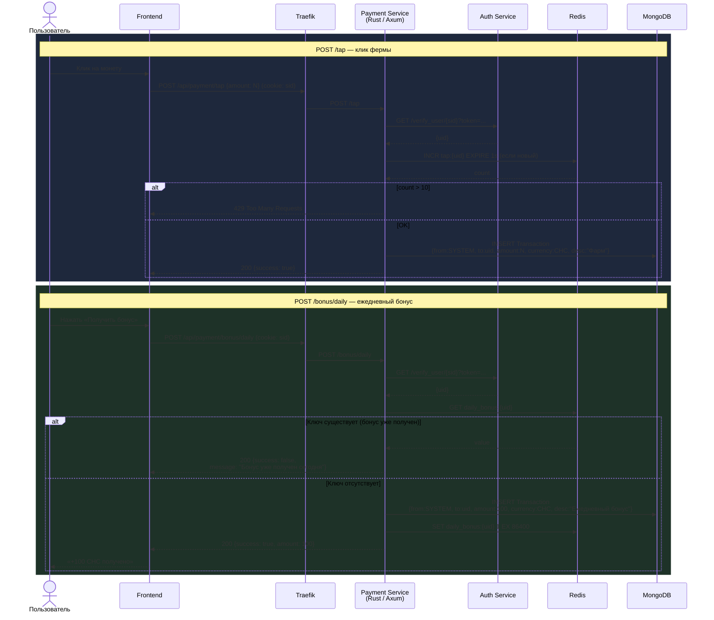
```mermaid
sequenceDiagram
    actor User as Пользователь
    participant FE as Frontend
    participant Traefik
    participant Payment as Payment Service<br/>(Rust / Axum)
    participant Auth as Auth Service
    participant Redis
    participant MongoDB

    rect rgb(30, 40, 60)
        Note over User,MongoDB: POST /tap — клик фермы
        User->>FE: Клик на монету
        FE->>Traefik: POST /api/payment/tap {amount: N} (cookie: sid)
        Traefik->>Payment: POST /tap

        Payment->>Auth: GET /verify_user/{sid}?token=...
        Auth-->>Payment: {uid}

        Payment->>Redis: INCR tap:{uid}  EXPIRE 1s (если новый)
        Redis-->>Payment: count

        alt count > 10
            Payment-->>FE: 429 Too Many Requests
        else OK
            Payment->>MongoDB: INSERT Transaction<br/>{from:SYSTEM, to:uid, amount:N, currency:CHC, desc:"Фарм"}
            Payment-->>FE: 200 {success: true}
        end
    end

    rect rgb(30, 50, 40)
        Note over User,MongoDB: POST /bonus/daily — ежедневный бонус
        User->>FE: Нажать «Получить бонус»
        FE->>Traefik: POST /api/payment/bonus/daily (cookie: sid)
        Traefik->>Payment: POST /bonus/daily

        Payment->>Auth: GET /verify_user/{sid}?token=...
        Auth-->>Payment: {uid}

        Payment->>Redis: GET daily_bonus:{uid}
        alt Ключ существует (бонус уже получен)
            Redis-->>Payment: value
            Payment-->>FE: 200 {success: false,<br/>message: "Бонус уже получен сегодня"}
        else Ключ отсутствует
            Payment->>MongoDB: INSERT Transaction<br/>{from:SYSTEM, to:uid, amount:100, currency:CHC, desc:"Ежедневный бонус"}
            Payment->>Redis: SET daily_bonus:{uid} 1  EX 86400
            Payment-->>FE: 200 {success: true, amount: 100}
            FE-->>User: «+100 CHC получено»
        end
    end
```

---

## B-UC-8.1 — Доступ администратора к управляющему UI через AML

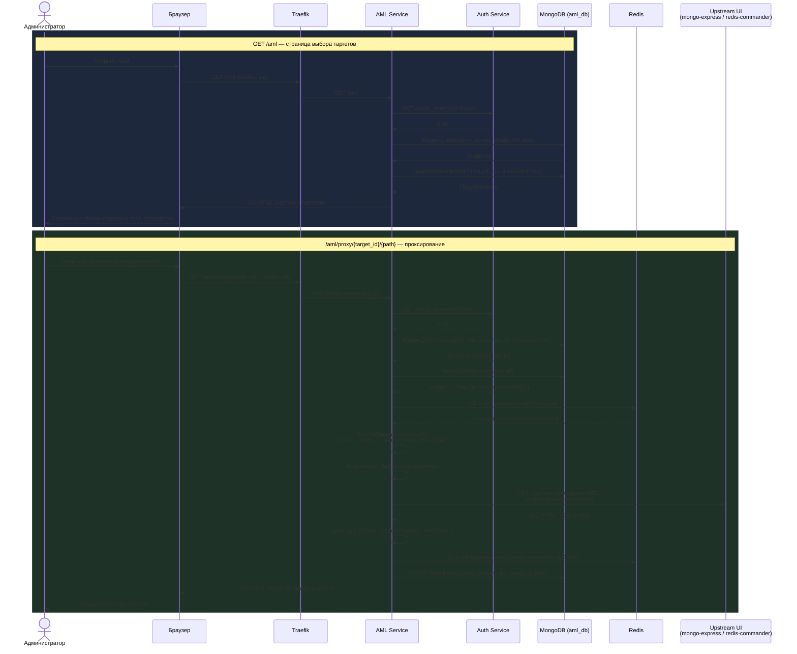
```mermaid
sequenceDiagram
    actor Admin as Администратор
    participant Browser as Браузер
    participant Traefik
    participant AML as AML Service
    participant Auth as Auth Service
    participant MongoDB as MongoDB (aml_db)
    participant Redis
    participant Target as Upstream UI<br/>(mongo-express / redis-commander)

    rect rgb(30, 40, 60)
        Note over Admin,MongoDB: GET /aml — страница выбора таргетов
        Admin->>Browser: Открыть /aml
        Browser->>Traefik: GET /aml (cookie: sid)
        Traefik->>AML: GET /aml

        AML->>Auth: GET /verify_user/{sid}?token=...
        Auth-->>AML: {uid}

        AML->>MongoDB: Mapping.find(admin_id=uid, disabled=False)
        MongoDB-->>AML: [Mapping]
        AML->>MongoDB: TargetSystem.find(id IN target_ids, disabled=False)
        MongoDB-->>AML: [TargetSystem]

        AML-->>Browser: 200 HTML (карточки таргетов)
        Browser-->>Admin: Страница с mongo-express и redis-commander
    end

    rect rgb(30, 50, 40)
        Note over Admin,Target: /aml/proxy/{target_id}/{path} — проксирование
        Admin->>Browser: Кликнуть на карточку mongo-express
        Browser->>Traefik: GET /aml/proxy/{target_id}/ (cookie: sid)
        Traefik->>AML: GET /aml/proxy/{target_id}/

        AML->>Auth: GET /verify_user/{sid}?token=...
        Auth-->>AML: {uid}

        AML->>MongoDB: Mapping.find_one(admin_id=uid, target_id, disabled=False)
        MongoDB-->>AML: Mapping {credentials_id}

        AML->>MongoDB: TargetSystem.get(target_id)
        MongoDB-->>AML: {endpoint: "http://mongo-express:8081"}

        AML->>Redis: GET aml:upstream:{uid}:{target_id}
        Redis-->>AML: upstream_cookies (JSON или null)

        AML->>AML: Расшифровать credentials<br/>KEK → DEK → plaintext (AES-256-GCM)
        AML->>AML: Фильтровать hop-by-hop заголовки

        AML->>Target: GET http://mongo-express:8081/<br/>(cookie: upstream_cookies)
        Target-->>AML: 200 HTML + Set-Cookie

        AML->>AML: apply_set_cookie_headers(cookies, Set-Cookie)
        AML->>Redis: SET aml:upstream:{uid}:{target_id} cookies  EX 3600

        AML->>MongoDB: INSERT AuditEvent {proxy_access, uid, target_id, path}
        AML-->>Browser: 200 HTML (ответ от mongo-express)
        Browser-->>Admin: Интерфейс mongo-express
    end
```

---

## B-UC-8.2 — Bootstrap маппингов при первом входе

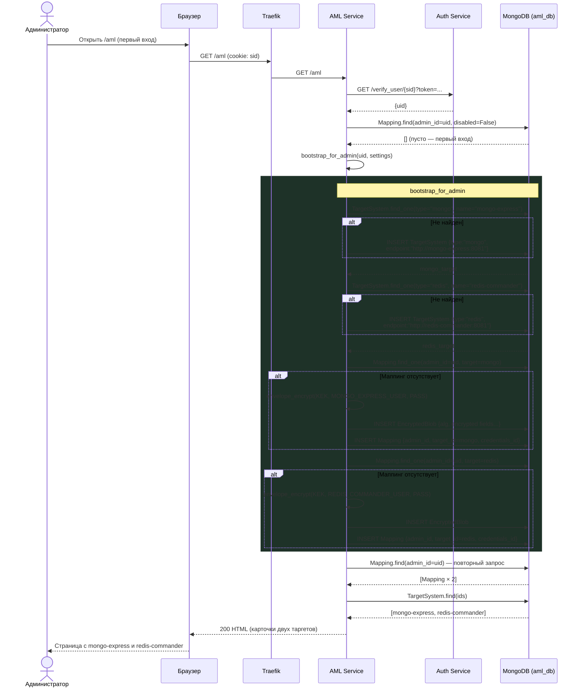
```mermaid
sequenceDiagram
    actor Admin as Администратор
    participant Browser as Браузер
    participant Traefik
    participant AML as AML Service
    participant Auth as Auth Service
    participant MongoDB as MongoDB (aml_db)

    Admin->>Browser: Открыть /aml (первый вход)
    Browser->>Traefik: GET /aml (cookie: sid)
    Traefik->>AML: GET /aml

    AML->>Auth: GET /verify_user/{sid}?token=...
    Auth-->>AML: {uid}

    AML->>MongoDB: Mapping.find(admin_id=uid, disabled=False)
    MongoDB-->>AML: [] (пусто — первый вход)

    AML->>AML: bootstrap_for_admin(uid, settings)

    rect rgb(30, 50, 40)
        Note over AML,MongoDB: bootstrap_for_admin

        AML->>MongoDB: TargetSystem.find_one(type="mongo", name="mongo-express")
        alt Не найден
            AML->>MongoDB: INSERT TargetSystem {type:"mongo",<br/>endpoint:"http://mongo-express:8081"}
        end
        MongoDB-->>AML: mongo_target

        AML->>MongoDB: TargetSystem.find_one(type="redis", name="redis-commander")
        alt Не найден
            AML->>MongoDB: INSERT TargetSystem {type:"redis",<br/>endpoint:"http://redis-commander:8081"}
        end
        MongoDB-->>AML: redis_target

        AML->>MongoDB: Mapping.find_one(admin_id=uid, target=mongo)
        alt Маппинг отсутствует
            AML->>AML: envelope_encrypt(KEK, MONGO_EXPRESS_USER, PASS)
            AML->>MongoDB: INSERT EncryptedBlob {alg, encrypted fields...}
            AML->>MongoDB: INSERT Mapping {admin_id, target_id=mongo, credentials_id}
        end

        AML->>MongoDB: Mapping.find_one(admin_id=uid, target=redis)
        alt Маппинг отсутствует
            AML->>AML: envelope_encrypt(KEK, REDIS_COMMANDER_USER, PASS)
            AML->>MongoDB: INSERT EncryptedBlob
            AML->>MongoDB: INSERT Mapping {admin_id, target_id=redis, credentials_id}
        end
    end

    AML->>MongoDB: Mapping.find(admin_id=uid) — повторный запрос
    MongoDB-->>AML: [Mapping × 2]
    AML->>MongoDB: TargetSystem.find(ids)
    MongoDB-->>AML: [mongo-express, redis-commander]

    AML-->>Browser: 200 HTML (карточки двух таргетов)
    Browser-->>Admin: Страница с mongo-express и redis-commander
```
