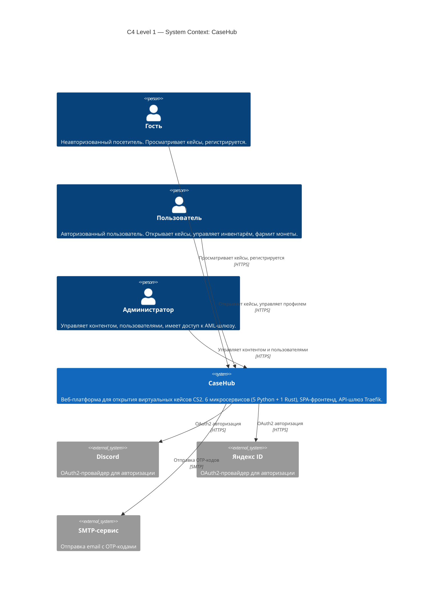

# C4 Level 1 — System Context Diagram

```mermaid
C4Context
    title C4 Level 1 — System Context: CaseHub

    Person(guest, "Гость", "Неавторизованный посетитель. Просматривает кейсы, регистрируется.")
    Person(user, "Пользователь", "Авторизованный пользователь. Открывает кейсы, управляет инвентарём, фармит монеты.")
    Person(admin, "Администратор", "Управляет контентом, пользователями, имеет доступ к AML-шлюзу.")

    System(casehub, "CaseHub", "Веб-платформа для открытия виртуальных кейсов CS2. 6 микросервисов (5 Python + 1 Rust), SPA-фронтенд, API-шлюз Traefik.")

    System_Ext(discord, "Discord", "OAuth2-провайдер для авторизации")
    System_Ext(yandex, "Яндекс ID", "OAuth2-провайдер для авторизации")
    System_Ext(smtp, "SMTP-сервис", "Отправка email с OTP-кодами")

    Rel(guest, casehub, "Просматривает кейсы, регистрируется", "HTTPS")
    Rel(user, casehub, "Открывает кейсы, управляет профилем", "HTTPS")
    Rel(admin, casehub, "Управляет контентом и пользователями", "HTTPS")
    Rel(casehub, discord, "OAuth2 авторизация", "HTTPS")
    Rel(casehub, yandex, "OAuth2 авторизация", "HTTPS")
    Rel(casehub, smtp, "Отправка OTP-кодов", "SMTP")

    UpdateLayoutConfig($c4ShapeInRow="3", $c4BoundaryInRow="1")
```

---

# C4 Level 2 — Container Diagram

```mermaid
C4Container
    title C4 Level 2 — Container Diagram: CaseHub

    Person(guest, "Гость", "Неавторизованный посетитель")
    Person(user, "Пользователь", "Авторизованный пользователь")
    Person(admin, "Администратор", "Управление контентом")

    System_Boundary(casehub, "CaseHub") {

        Container(spa, "SPA Frontend", "React 19, TypeScript, Vite 7", "Single-Page Application. TanStack Router/Query, Tailwind CSS, Framer Motion.")
        Container(traefik, "API Gateway", "Traefik v3", "Reverse proxy, маршрутизация к микросервисам. Порт 80.")

        Container(auth, "Auth Service", "Python, FastAPI", "OAuth2, email OTP, сессии (HMAC), межсервисная валидация. :8000")
        Container(usersvc, "User Service", "Python, FastAPI", "Профили, CRUD, публичные профили, Redis Streams RPC. :8001")
        Container(cases, "Cases Service", "Python, FastAPI", "Кейсы, открытие, инвентарь, SSE-лента, ферма. :8002")
        Container(payment, "Payment Service", "Rust, Axum", "Баланс, транзакции, tap/ферма, бонусы. :8003")
        Container(adminsvc, "Admin Service BFF", "Python, FastAPI", "Панель администратора, проксирование CRUD, загрузка изображений. :7777")
        Container(aml, "AML Service", "Python, FastAPI", "Access Mapping Layer: безопасный прокси к Mongo Express и Redis Commander.")

        ContainerDb(mongo, "MongoDB 8.0", "NoSQL", "Сессии, пользователи, кейсы, предметы, инвентарь, транзакции.")
        ContainerDb(redis, "Redis 8.4", "Cache / Broker", "Кэш сессий, OTP, Redis Streams RPC, Pub/Sub SSE-лента.")
        ContainerDb(rustfs, "RustFS", "S3 Storage", "Изображения предметов и кейсов.")

        Container(monitoring, "Мониторинг", "Prometheus, Grafana, Loki", "Метрики, логи, дашборды.")
    }

    System_Ext(discord, "Discord OAuth2", "OAuth2-провайдер")
    System_Ext(yandex, "Яндекс ID", "OAuth2-провайдер")
    System_Ext(smtp_ext, "SMTP-сервис", "Отправка email")
    System_Ext(mongoex, "Mongo Express", "MongoDB Web UI")
    System_Ext(rediscmd, "Redis Commander", "Redis Web UI")

    Rel(guest, spa, "Использует", "HTTPS")
    Rel(user, spa, "Использует", "HTTPS")
    Rel(admin, spa, "Использует", "HTTPS")

    Rel(spa, traefik, "API-запросы, SSE", "HTTP/JSON")

    Rel(traefik, auth, "Маршрутизация", "/api/auth/*")
    Rel(traefik, usersvc, "Маршрутизация", "/api/community/*")
    Rel(traefik, cases, "Маршрутизация", "/api/cases/*")
    Rel(traefik, payment, "Маршрутизация", "/api/payment/*")
    Rel(traefik, adminsvc, "Маршрутизация", "/api/admin/*")
    Rel(traefik, aml, "Маршрутизация", "/aml/*")

    BiRel(auth, usersvc, "RPC: user.rpc / auth.rpc", "Redis Streams")
    Rel(cases, auth, "Верификация сессий", "HTTP")
    Rel(cases, payment, "Баланс, транзакции", "HTTP")
    Rel(adminsvc, cases, "Проксирование CRUD", "HTTP")
    Rel(adminsvc, auth, "Верификация", "HTTP")
    Rel(aml, auth, "Аутентификация", "HTTP")

    Rel(auth, mongo, "Чтение/запись", "Beanie ODM")
    Rel(usersvc, mongo, "Чтение/запись", "Beanie ODM")
    Rel(cases, mongo, "Чтение/запись", "Beanie ODM")
    Rel(payment, mongo, "Чтение/запись", "mongodb crate")

    Rel(auth, redis, "Кэш, Streams", "redis-py")
    Rel(usersvc, redis, "Кэш, Streams", "redis-py")
    Rel(cases, redis, "Pub/Sub, List", "redis-py")
    Rel(payment, redis, "Кэш", "redis crate")

    Rel(adminsvc, rustfs, "Загрузка файлов", "S3 API / boto3")

    Rel(auth, discord, "OAuth2", "HTTPS")
    Rel(auth, yandex, "OAuth2", "HTTPS")
    Rel(auth, smtp_ext, "OTP-коды", "SMTP")
    Rel(aml, mongoex, "Прокси", "HTTP")
    Rel(aml, rediscmd, "Прокси", "HTTP")
    Rel(monitoring, auth, "Сбор метрик", "/metrics")

    UpdateLayoutConfig($c4ShapeInRow="4", $c4BoundaryInRow="1")
```
